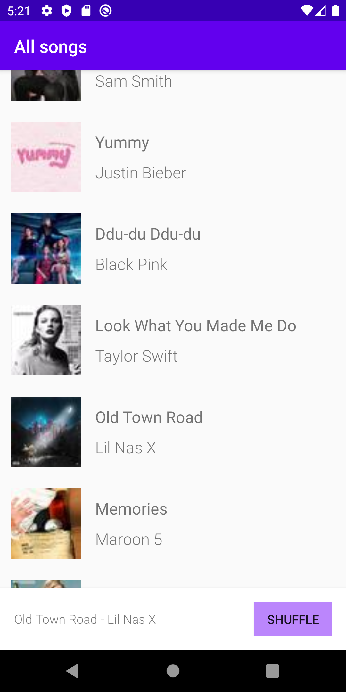
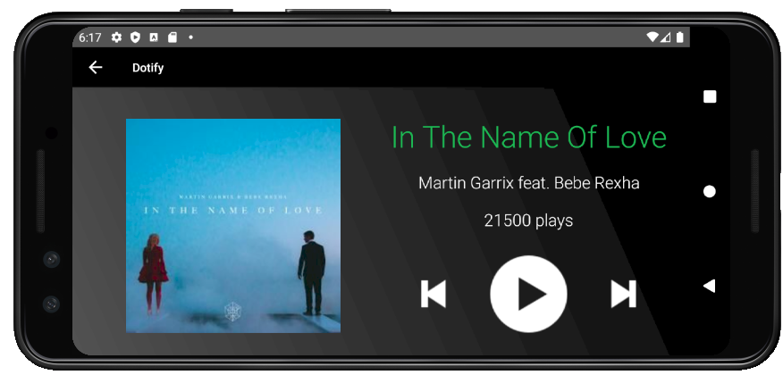

# Dotify by Saasha Mor

This is a proof of concept for an app where people can listen to music on the cloud.
This app has the following functionality:
- Click on song in list to change song in mini player
- Shuffle song list by clicking the "Shuffle Button"
- Click on the mini player on the bottom to display full view of song
- Click the previous or next buttons to "Skip song"
- Click the play button to increase number of plays
- Rotate screen in full view for new layout
- **Dotify now uses Fragments and the wonders of the Activity Lifecycle to make it run smoothly!**

## Extra credit
No Extra Credit present

## Screenshots

## Installation & Usage
N/A
